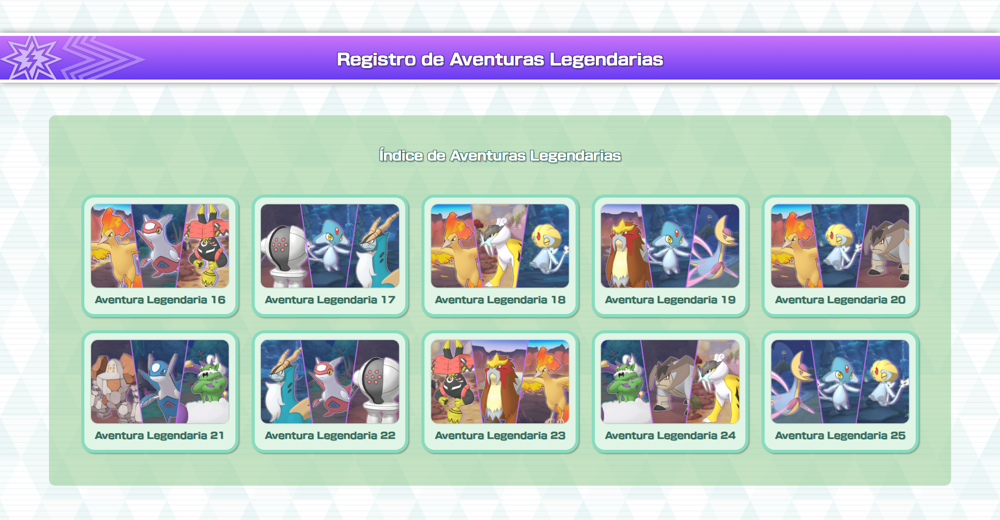

# Pokémon Másters EX - Registro de Aventuras Legendarias

_De ahora en adelante la web se referirá por el nombre de **PoMaRAL** (siglas de **Po**kémon **Ma**sters **R**egistro de **A**venturas **L**egendarias)._

Esta web está dedicada a recopilar equipos y estrategias para los eventos de Aventura Legendaria de Pokémon Masters EX.

## Características

- Cada evento de Aventura Legendaria registra un listado de combates que tuvieron lugar durante dicho evento.
- Acceso a listado de combates por Pokémon legendario enfrentado. Es decir, todos los equipos a los que se han enfrentado en combate al mismo Pokémon legendario.
- Cada combate cuenta con la información necesaria para poder completarse con éxito: mejoras de los compis, tableros y consejos de cómo enfrentar las batallas más eficientemente.
- Navegación tanto entre las diferentes Aventuras Legendarias como por el listado de Pokémon Legendarios.
- Siempre que haya una Aventura Legendaria en curso, quedará destacada en la pantalla principal de PoMaRAL durante todo el evento así como los Pokémon protagonistas del enfrentamiento.

## Aviso legal
Pokémon © Nintendo / Creatures Inc. / GAME FREAK inc.

Pokémon Masters EX © DeNA Co., Ltd.

Este proyecto es una página no oficial y sin fines lucrativos. PoMaRAL no está afiliado, asociado ni respaldado por Nintendo, The Pokémon Company o DeNA.

Todas las imágenes, nombres, personajes y recursos relacionados con Pokémon pertenecen a sus respectivos propietarios.

## Licencia

El código fuente de este repositorio se distribuye bajo la licencia MIT.

Los recursos visuales, marcas registradas e imágenes de Pokémon no están incluidos en dicha licencia y pertenecen a sus respectivos propietarios.